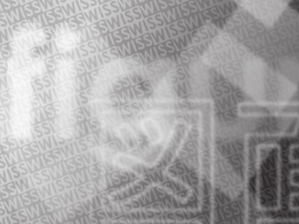

# はじめに

この \LaTeX 2e用スタイルクラスは，WISS \the\year における論文投稿用である．
2014年からはWordテンプレートを用意した．
著者各位においては，
WISS のホームページ[@wiss]および
以下の注意を熟読して効率的な論文執筆をされるよう望む．
やむをえず他の手段で原稿を書く場合は，限りなく同じ形式に仕上げること．
著しく異なる形式の場合，不採録の理由となる場合がある．

# 論文執筆について

## 全般的な注意事項

このスタイルクラスを利用するには，
`wiss.cls`，`wissbase11.cls`，`jwiss.bst`を
コンパイラが参照できるパスに置く．
通常は \TeX 文書ファイルと同じディレクトリに置けば自動的に参照される．
また \TeX 文書の先頭にある `\documentclass` で `wiss` を指定する．
全体としては右の枠線内のようになる．

論文の文体は「だ」「である」調，句読点は「，」「．」を強く推奨する．
図のレイアウトなどの特別な場合を除いて本文は2段組とする．
原稿は **A4サイズpdf出力** し，
上下左右のマージンは厳守しなければならない．
また，ページ数は必ず規定のページ数でなければならない
（詳細は査読方針 <http://qwik.wiss.org/wiss2018/review_policy.html> を参照）．

Overfull (規定の枠内からはみ出して文字を書くこと)してはならない．
本文中や参考文献で長いURLなどを書き入れると，
`http://www.sample.url.xx.yyy/` のように
Overfullが発生することがある．
必ず仕上がりを確認し，このようなことが起きないように文章を調整する．
URLの場合は `\url{}` を使うことによって適切な個所で改行される．
はみ出した部分については編集者において削除することがある．

```
\documentclass[twoside]{wiss}
.....
\journalhead{...}
\begin{document}
\title{...}
\etitle{...}
\author{...
    \affil{...}}
\begin{abstract}
.....
\end{abstract}
\maketitle
\section{...}
本文...

\bibliographystyle{jwiss}
\bibliography{...}

\begin{figure*}[!b]
未来ビジョン関連のlatex記述
\end{figure*}
```

## 表題，著者名，著者所属，概要

和文タイトルを `\title{}` と `\journalhead{}` の**両方に**書く．
`\journalhead{}` に書かれたタイトルは
3ページ目以降の奇数ページのヘッダ（ハシラ）として現れる．
この際，必ず表題と同じになっているかを確認すること．
また，1ページ目のタイトルは右側の余白にはみ出さないように注意する．

 {#fig:header width=\\linewidth,height=0.5\\paperheight}

原稿を作成する場合，著者は必ず仕上がりを確認する．
3ページ以上の原稿については，
3ページ目以降の奇数ページのヘッダ(ハシラ)がページ幅を越えないように
適切な長さのタイトルを付けること．
ヘッダ(ハシラ)は途中で改行してはならない．
また，`\journalhead{}`の中を空にしてはならない．
なお，ページ番号はページ下部中央に書き込まれる．

シングルブラインド査読のため，投稿時に著者名，所属を記入すること．
著者名の姓と名の間には半角スペースを入れ，
著者名の区切りはタブまたは2文字以上の全角スペースを用いる．
カンマ区切りではないので注意．
著者の所属が著者によって異なる場合は，上付き文字でマークをつけ，
所属名をマークごとに1p目左下「Copyright is held by the author(s).」の次の行に記入する．英文名を併記する必要はない．
また，全著者の所属が同じ場合は，マークを付ける必要はない．

アブストラクト（論文概要）は， `\begin{abstract}` と `\end{abstract}` の間に，
400文字程度の和文で書く（英文は2012年で廃止）．
「概要．」と概要本文の間は改行せず，一続きで書く．

## 本文

`\section{}`，`\subsection{}`など，
スタイルクラスで用意されている章立てを用いながら，
通常の \LaTeXe 文書執筆の要領で書く．

誤字脱字や参照の不一致が散見されるなど，
最低限の推敲が為されていないと判断された場合，
査読を行わずに不採録となる場合がある (Quick Reject)．
共著者によるチェックも投稿前に受け，十分にチェックの上投稿すること．
図表については十分な画質があるように著者において出力すること．
なお，写真などもすべて原稿中に組み込んで出力すること．

## 参考文献

参考文献は，本文で「文献\[3]\[4]で…」というようにカッコ書きで引用し，
文末に参考文献リストを作成する．
本文中では参考文献リスト中の `\bibitem{}` をキーにして，
本文中に `\cite{}` と記述することで引用することができる．

例）参考文献リストにおいて

`\bibitem{rekimoto2000}` と記述した場合，

本文中に `\cite{rekimoto2000}` と記述すると [@rekimoto2000] と表示される．

参考文献リストは *JBib*\TeX を用いて
文献データベースから自動生成することを強く推奨する．
文献スタイルは `jwiss` を使う．
手書きで作成する場合には，文末の例のように
著者名，論文名，所収冊子名(英文の場合には斜体)，ページ番号，発行年を書く．
英文で著者名を書く場合には，
名(first name) のイニシャル，姓(last name)の順に書く．
共著者が多い場合には「et al.」で省略してもよい．
このテンプレートでは，同梱の `wiss_template.bbl` が
参考文献リストになっているので適宜参照のこと．
英語の文献リストの書式としてはIEEE style manual[@IEEE2014]が詳しい．

なお，参考文献にURLを指定する場合には，
そのページが存在していることを投稿前に必ずもう一度確認し，参照日を記載する．
本来，ニュース記事のように短い期間でURL が変更されたり
ページ自体が消滅する恐れのあるWebページは参考文献として好ましくない．

## 未来ビジョン

未来ビジョンについては，必須とせず任意とする．
論文本体とは別に，
「この研究はどういう未来を切り拓くのか」について，
著者の視点からアピールしたい点があれば，
最終頁に欄を設けて設けて自由に議論する．
外枠の大きさはページ下余白から最大93mmの範囲であれば，
ある程度改変してもよいものとする．

# 論文作成の例

`\section{論文作成の例}` と書くと上のように表示される．

## 図表挿入の例

`\subsection{図表挿入の例}` と書くと上のように表示される．

### 表の例

`\subsubsection{表の例}` と書くと上のように表示される．
表[@tbl:restaurant]は表の例である．

|                      | 値段     | スピード |
| :------------------: | :------: | :------: |
| 高級料亭             | 高い     | 遅い     |
| ファミリーレストラン | 中ぐらい | 中ぐらい |
| ファーストフード     | 安い     | 早い     |

Table: 食欲を満たす方法と特徴 {#tbl:restaurant}

 {#fig:one_image width=0.5\\linewidth}

### 図の例

`\subsubsection*{図の例}` と書くと上のように表示される．
アスタリスク(*)をつけたことにより番号が表示されない[^note-paperist-asterisk]．
図[@fig:one_image]は論文中に図面を挿入した例である．

[^note-paperist-asterisk]: Paperist 非対応

## 図表の配置

全ての図表は「…を図 5に示す」「…である（表 2）．」というように本文から引用し，
図表自体はその文と同じページか，それ以降のページに配置する．
読む順番の観点から，初出の文章より前のページに図を掲載することは厳禁である．

まれに，編集中に図の位置がずれて
ヘッダやフッタ部に重なってしまっていることがあるので，投稿前に十分に確認されたい．

 {#fig:graph onecolumn,width=0.5\\paperwidth}

図[@fig:graph]は，2段抜きの図の例である．
2段抜きの図を挿入するときには，
`\begin{figure}`の代わりに`\begin{figure*}`とし，
`\end{figure*}`で終わるようにすればよい．
同様に`table`についても `*` をつけることで2段抜きにできる．

ただし2段抜きの図や表は，\LaTeX によって別のページに移動して
張り付けられてしまうことが多いので注意が必要である．

## キャプション，図表中のテキスト

図表のキャプションについては，図の場合は図の下，表の場合は表の上に配置する．

図中の注釈などのテキストはキャプションと同じかやや小さいサイズ，
読みやすさの観点ではゴシック系フォントの利用が望ましい．
表のテキストもキャプションと同じかやや小さいサイズが望ましい．

## 図作成上の注意点

原稿を作成する場合，著者は必ず仕上がりを確認し，
図が鮮明に，意図した場所に出力されることを確認する．
特に，次の点に留意すること．

- 画面キャプチャした画像を使って図を作る際，非可逆圧縮を使わないこと．
    画面キャプチャした画像をファイルに保存する場合には，
    保存形式として非圧縮形式(BMP等)または可逆圧縮形式(GIF，PNG等) を用いる．
- 図に文字を使って注釈を書き込む場合，極力，アウトラインデータの文字を用いること．
    ビットマップデータの文字を用いた場合，文字の輪郭がギザギザに見える．

## 数式の例

数式の書き方の詳細はIEEE style manual[@IEEE2014]を参照．
長すぎる数式は適宜改行し，余白にはみ出さないようにすること．

式([@eq:sum])は数式の例である．

$$
\sum^{N}_{n=1}n = \frac{1}{2}N(N+1)
$$ {#eq:sum}

## 節と項の数について

1つの章の中に節を作るときは必ず複数個の節を作ること．
1個しか節を作る必要がないときはそもそも節に分ける必要がない，ということである．
同様に，1節の中に1個しか項がない，という場合も章構成を見直す．

良い例）1章→1.1節，1.2節，2章…

悪い例）1章→1.1節，2章…

# 著作物の利用について

論文中に掲載する写真，イラストについて，他者の著作物ではないか，
肖像権等に問題はないか，など十分に留意し，
必要に応じて適切な手続き，記述の追加を行うこと．

# むすび

このサンプルは次の環境を用いて動作を確認した．

- UNIX用の p\LaTeXe (p\TeX3.1.2)
- Windows用の p\LaTeXe (p\TeX3.1.3)

本スタイルシートが著者諸氏の論文作成に役立つことを期待する．

# テスト文章

吾輩は猫である。名前はまだ無い。

どこで生れたかとんと見当がつかぬ。何でも薄暗いじめじめした所でニャーニャー泣いていた事だけは記憶している。吾輩はここで始めて人間というものを見た。しかもあとで聞くとそれは書生という人間中で一番獰悪な種族であったそうだ。この書生というのは時々我々を捕えて煮て食うという話である。しかしその当時は何という考もなかったから別段恐しいとも思わなかった。ただ彼の掌に載せられてスーと持ち上げられた時何だかフワフワした感じがあったばかりである。掌の上で少し落ちついて書生の顔を見たのがいわゆる人間というものの見始であろう。この時妙なものだと思った感じが今でも残っている。第一毛をもって装飾されべきはずの顔がつるつるしてまるで薬缶だ。その後猫にもだいぶ逢ったがこんな片輪には一度も出会わした事がない。のみならず顔の真中があまりに突起している。そうしてその穴の中から時々ぷうぷうと煙を吹く。どうも咽せぽくて実に弱った。これが人間の飲む煙草というものである事はようやくこの頃知った。

この書生の掌の裏でしばらくはよい心持に坐っておったが、しばらくすると非常な速力で運転し始めた。書生が動くのか自分だけが動くのか分らないが無暗に眼が廻る。胸が悪くなる。到底助からないと思っていると、どさりと音がして眼から火が出た。それまでは記憶しているがあとは何の事やらいくら考え出そうとしても分らない。

文章量が増えると，本文と未来ビジョンが重なるため，
重ならないように文章量を調整すること．
